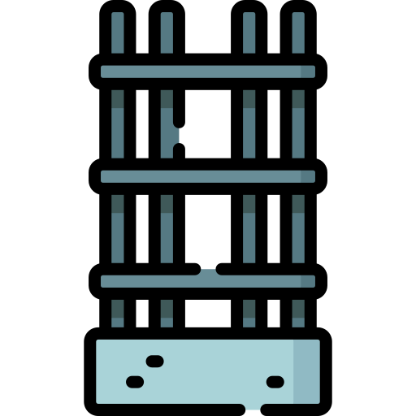
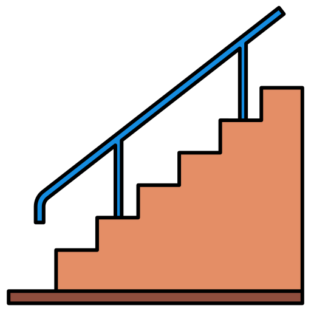
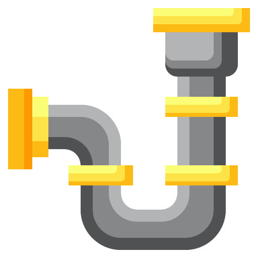
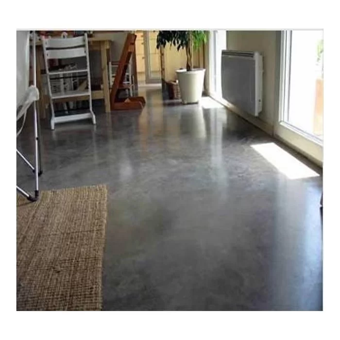
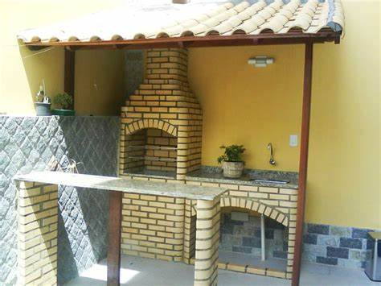
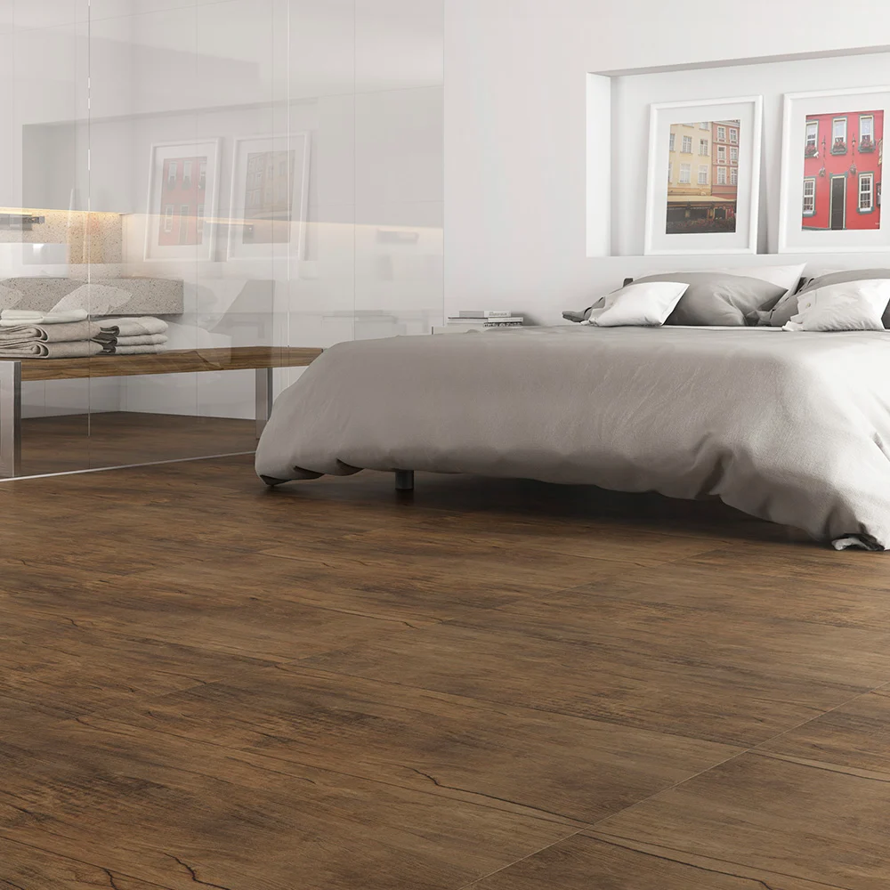
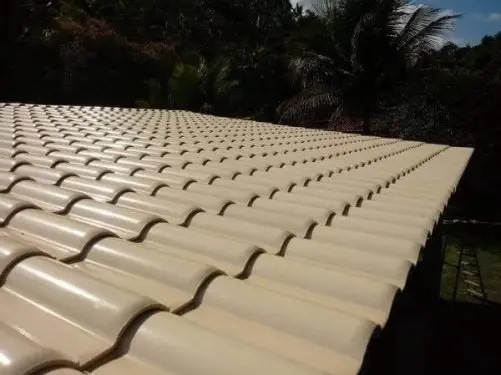

<!DOCTYPE html>
<html lang="pt-br">

<head>
    <meta charset="UTF-8">
    <meta name="viewport" content="width=device-width, initial-scale=1.0">
    <title>Feras da Construção</title>
    <link rel="stylesheet" href="style.css">
</head>

<body>
    <header>
        <h1>Feras da Construção</h1>
        <h3>há mais de 10 anos contruindo sonhos com responsabilidade</h3>
        
Dono e fundador: Marcio Barbosa 

    </header>

    <ul class="lista">
        <li>
            <h5>Especialidades:
        </li>
        </h5>
        <li>Estruturas</li>
        <li>Lajes</li>
        <li>Alvenaria</li>
        <li>Escada de concreto</li>
        <li>Hidrualica</li>
        <li>Elétrica</li>
    </ul>

    

        
 Piso realizado com cimento queimado, uma nova maneira de deixar sua area mais bonita e sem
            poeira.
             
            
        

        
Churrasqueira feita com tijolo maciço, tecnica e excelencia dos feras.
             
             
            

        

        
Piso laminado, otima opção para quartos e escritórios, também somos qualificados para atender
            este serviço.
             
             
            

        

        
Trabalhamos com telha de ceramica esmaltado, retem calor, dificil de quebrar e de boa
            estética.
             
             
            

        

    

    

        

            
Biografia:
            

             
            Marcio Pinto Barbosa é natural de São Borja, reside a mais de 30 na capital dos gauchos.
            Profissional dedicado e ama o que faz,teve sua formação na Escola Tecnica Parobé e experiencias no Hospital
            Ernesto Dorneles e Polo Petroquimico, pós essas experiencias e tendo na familia muitos contrutores, decidiu
            abrir uma empresa, Feras da construção.
            Então desde 2010 na estrada das contruções a empresa ja deixou muitos clientes contentes e tem como meta
            expandir seus horizontes atendendo outros estados além da capital.
        
 
        
    

    

        <h2>Solicite seu Orçamento</h2>
        <form action="processar-orcamento.php" method="POST">
            <label for="nome">Nome:</label>
            <input type="text" id="nome" name="nome" required>
             
            <label for="celular">Celular:</label>
            <input type="tel" id="celular" name="celular" required>
             
            <label for="email">Email:</label>
            <input type="email" id="email" name="email" required>
             
            <label for="servico">Serviço solicitado:</label>
            <textarea id="servico" name="servico"></textarea>
             
            <input type="submit" class="button" value="Enviar">
        </form>
    

    

        
Email enviado com sucesso!

        <button id="ok-button">OK</button>
    

</body>

<!-- Caminho para o arquivo JavaScript -->

</html>
